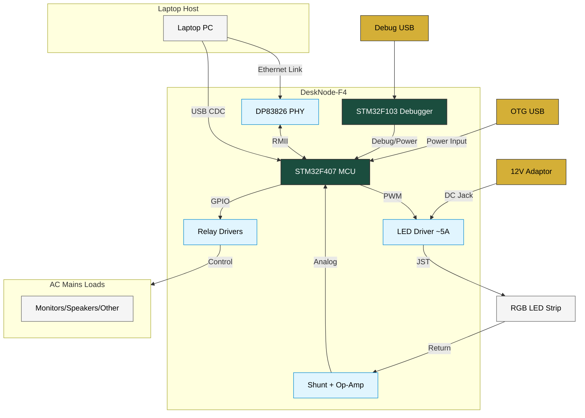

# DeskNode-F4: Desk Automation Node

**DeskNode-F4** is an intelligent, high-current desk automation controller designed to eliminate phantom standby power and manage workspace environments dynamically. Built around the **STM32F407VGT6** microcontroller, the board intercepts host sleep/wake signals to automatically switch power rails for major workspace appliances and custom peripherals.

---

## 📊 System Architecture Block Diagram

---

## 🛠️ System Architecture Overview

The core of the system is a custom **4-layer PCB** configured with a high-integrity stackup (**Signal / GND / Power / Signal**) to isolate sensitive analog paths from high-power switching transients.

### Onboard Hardware Features
* **Microcontroller:** STM32F407 ARM Cortex-M4 operating with a high-performance clock tree to coordinate networking, USB stacks, and deterministic control loops.
* **Onboard Debugger:** Integrated STM32F103-based DAP-Link. This permits single-cable firmware flashing and debugging directly over the `Debug USB` port without requiring external programmers.
* **Networking Subsystem:** DP83826 Physical Layer (PHY) transceiver linked to the MCU via a low-pin-count **RMII (Reduced Media Independent Interface)** bus. It provides a dedicated pipeline for sending continuous telemetry and log metrics to an external server or logging application.
* **Dual Power Inputs:** Flexible bus powering options allow the system logic to run entirely off the `Debugger USB (5V)` line or the primary `OTG USB (5V)` interface.

### Peripheral Control & Telemetry Loops
* **High-Current LED Driver:** A dedicated ~5A PWM driver stage capable of dimming and driving dense RGB LED strips utilized for monitor backlighting.
* **Current Telemetry (Shunt + Op-Amp):** A low-side inline current shunt paired with a precision operational amplifier provides analog current sensing feedback directly to the MCU's internal ADC. This ensures overload protection and active power calculation.
* **Relay Driver Array:** Low-voltage GPIO pins drive transistor/optocoupler stages to switch external heavy-duty AC relay modules safely.

---

## 🔄 Sequence of Operation

The system functions on a deterministic host-state monitoring loop via a virtual COM port over USB:

| Laptop State | USB CDC Pipeline | DeskNode-F4 Action |
| :--- | :--- | :--- |
| **Laptop Wakes** | Sends `"WAKE"` Token | 1. Latches AC Relays **ON**   2. Ramps up Monitor LED Strip and Speakers |
| **Laptop Sleeps** | CDC Connection Drops | 1. Unlatches AC Relays **OFF**   2. Cuts LED Strip Power |

### 1. The Wake Sequence (Power-On)
1. The host laptop wakes from standby or a sleep state.
2. An automation daemon running on the host detects the system state change and establishes a **USB CDC (Communications Device Class)** virtual serial connection.
3. The host transmits a configuration/activation token to the `DeskNode-F4` over USB.
4. The MCU immediately asserts its control GPIOs:
    * **Relay Output Pins** transition to high, latching the AC relay modules to deliver mains power simultaneously to **Monitor 1, Monitor 2, the Laptop Power Adaptor, and the Home Theatre System**.
    * **PWM Driver** initializes to ramp up the RGB backlight strip to the user's preferred brightness level via the onboard JST connection.

### 2. Continuous Monitoring State
* While active, the board uses the **DP83826 Ethernet PHY** to broadcast runtime diagnostics (uptime, temperature, and power drawing conditions) back to the laptop's logging software.
* The internal ADC continuously updates using the operational amplifier feedback loop across the shunt resistor to verify the current draw of the 5A LED string remains within a safe operating safe area (SOA).

### 3. The Sleep Sequence (Zero-Standby Power)
1. The host laptop enters a low-power sleep mode or is shut down.
2. The active USB CDC bus is dropped or broadcasts a graceful shutdown command packet.
3. Upon detecting the drop in the USB connection state, the `STM32F407` executes an emergency environment teardown:
    * All **GPIO Relay Driver lines** drop low, physically disconnecting the mains AC power lines. This drops the idle standby current consumption of the entire desk setup (monitors, sound systems, bricks) down to **absolute zero**.
    * The LED driver PWM is pulled to a 0% duty cycle, turning off the backlight completely.
    * The board drops into a low-power listening loop, drawing minimal parasitic power through the connected USB line until the next wake event.
